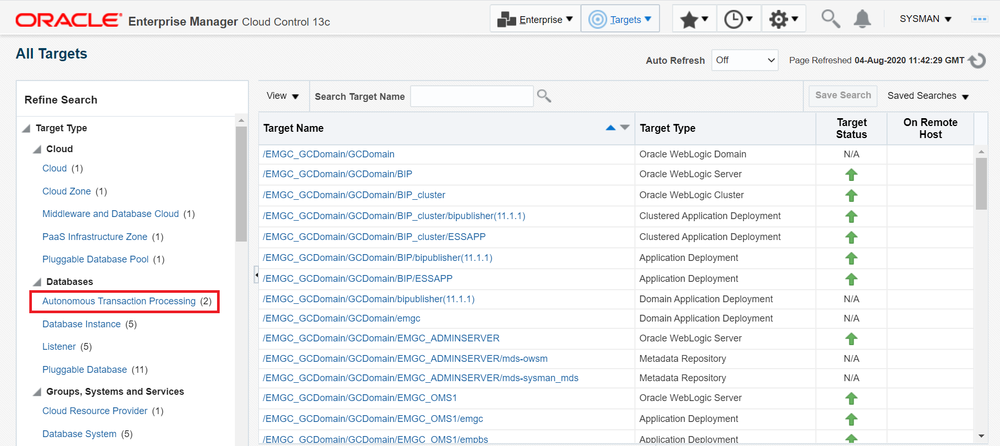
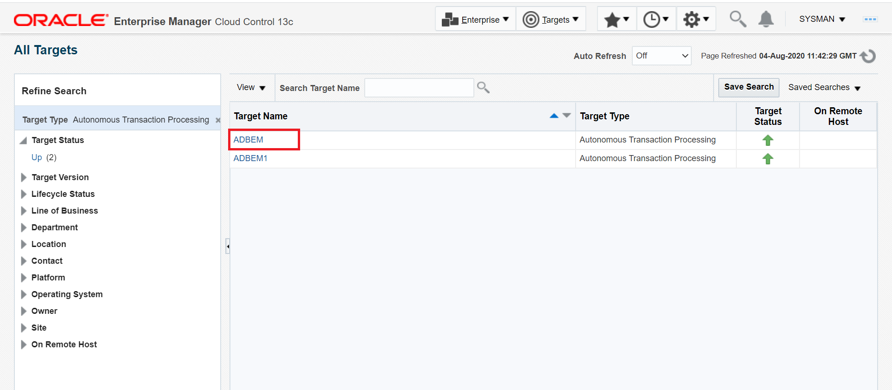
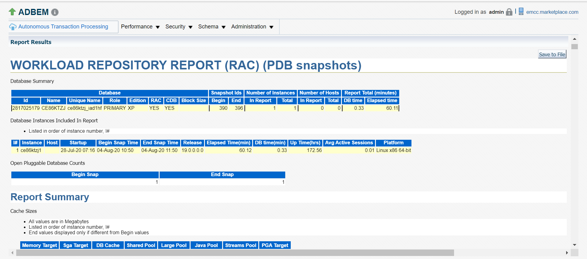

# AWR Management of Autonomous Transaction Processing Dedicated database using Oracle Enterprise Manager

## Introduction
Use Automatic Workload Repository (AWR) and automate database statistics gathering by collecting, processing, and maintaining performance statistics for database problem detection and self-tuning purposes.

*In this lab we will see the capabilities of Oracle Enterprise Manager in generating AWR reports.*

Estimated Time: 20 minutes

### Objectives

As a Database Administrator:

1. Learn how to generate AWR report of your ATP Dedicated Database using Oracle Enterprise Manager.
2. Learn how to change retention period of AWR report generated for your ATP Dedicated Database using Oracle Enterprise Manager.
3. Compare the two AWR reports of ATP Dedicated database taken at different intervals, using OEM.

### Required Artifacts

   - An Oracle Cloud Infrastructure account.
   - A pre-provisioned dedicated autonomous database instance. Refer to the **Provisioning Databases** lab in the **Introduction to ADB Dedicated for Developers and Database Users** workshop.
   - Successful connection of ATP dedicated database from OEM.

## Task 1: Generate AWR report for ATP dedicated database from OEM

- Log in to your OEM from your browser as **sysman** user.

    

- Click **Targets** and select **All Targets**.

    

- Click **Autonomous Transaction Processing** and select **ADBEM** (name of your ATP database).

    

    

- Click **Performance**, select **AWR**, and then click **AWR Report**.

    

- Select the **Begin Snapshot** and **End Snapshot** and click **Generate Report**.

    

    

## Task 2: Change the AWR retention period of the report generated

- On the OEM home page click **Performance**, select **AWR**, and then click **AWR Administration**.

    

- Click **Edit**.

    

- Change **Retention Period**.

    

- Click **OK**.

    

    

## Task 3: Compare two AWR reports of different periods

- Click **Performance**, select **AWR**, and then click **Compare Period Reports**.

    

- Select the **Begin Snapshot** and **End Snapshot** for **First Period** and **Second Period**.

    

- Click **Generate Report**.

    

## Acknowledgements

*Congratulations! You have successfully completed AWR report analysis using Oracle Enterprise Manager .*

- **Authors** - Navya M S & Padma Priya Natarajan
- **Last Updated By/Date** - Kris Bhanushali, March 2022

## See an issue or have feedback?
Please submit feedback [here](https://apexapps.oracle.com/pls/apex/f?p=133:1:::::P1_FEEDBACK:1).   Select 'Autonomous DB on Dedicated Exadata' as workshop name, include Lab name and issue / feedback details. Thank you!
