# Improve Governance, Service experience and Usage reporting using Oracle Standard Tags

## Introduction
Oracle Cloud Infrastructure Tagging allows you to add metadata to resources, which enables you to define keys and values and associate them with resources. You can use the tags to organize and list resources based on your business needs.
Tagging provides valuable insights into customer's usage of cloud resources and more importantly, allows customers to build a governance model. As customer's expand their cloud footprint it becomes challenging to keep track of deployment architectures, security best practices, MAA and application tiering etc. Unless metadata tags are used to identify  workload attributes, security and availability may creep into their tenancy, besides cost overruns.
In addition, service owners can deploy optimized configuration based on workload attributes identified via tags.
Integration with the newly announced Cloud Advisor OCI service can provide customers with direct, deep insight into how well their cloud services are adhering to corporate guidelines and allow customer management to govern with vision and oversight.

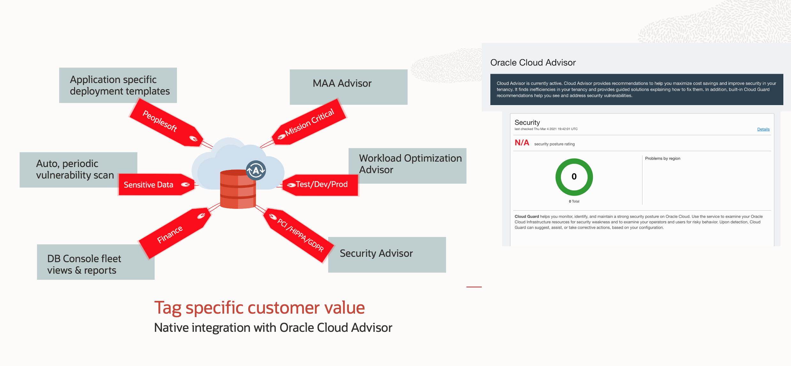

Estimated Time: 20 minutes

### Objectives

As an adminstrator:
1. To apply Oracle provided tagging framework as standard practice.
2. Utilize Oracle Standard Tags for reporting and cost tracking

### Required Artifacts

- An Oracle Cloud Infrastructure account.
- Right permission for users to work with Tags. Refer to [this documentation](https://docs.oracle.com/en-us/iaas/Content/Tagging/Tasks/managingtagsandtagnamespaces.htm#Who) to allow users to work with Tags.
- Have access to **Root Compartment** to import Oracle Standard Tags to the Tenancy.

## Task 1: Import Standrad Tags to your Tenancy

- Log in to OCI console and navigate to **Governance & Administration** and click on **Tag Namespaces**

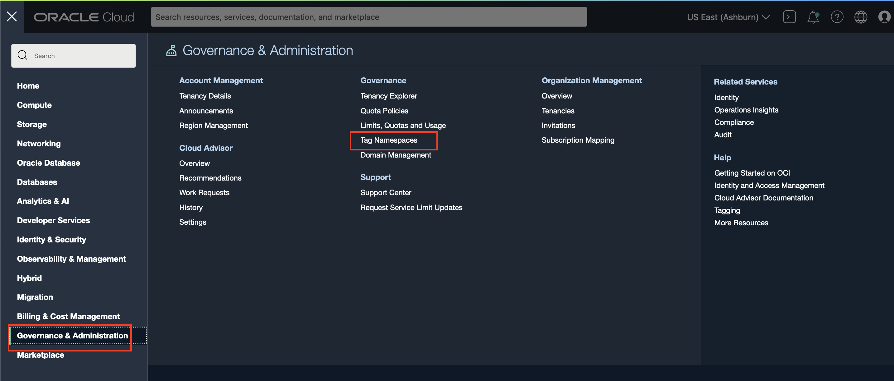

**Import Standard Tags** is only available from **root compartment**. 

- Select **root compartment** from **Compartment** dropdown, and click on **Import Standard Tags**. 

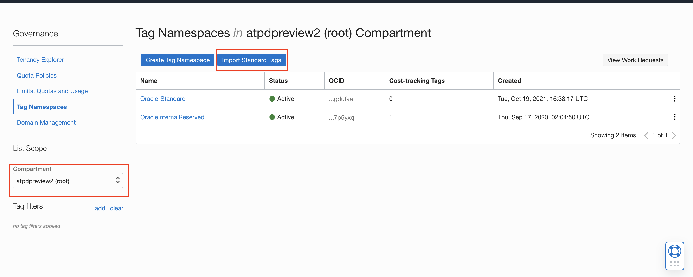

- **Import Standard Tags** page provides a set of Tag Keys for consistent governance across your tenancy. Tag namespace will be created at the root compartment. 

**The list of namespaces are continuously updated by OCI service teams. All new and modified Tags will be listed in Import Standard Tags page**.

**Oracle-ApplicationName**, **Oracle-Standard** are available under Import Stadard tags. 

- Select **Oracle-Standard** and click on the expand link to see the list of **Tag Key Definitions**.

- Click on **Import** to create **Oracle-Standard** Tag Namespace at the root compartment. 

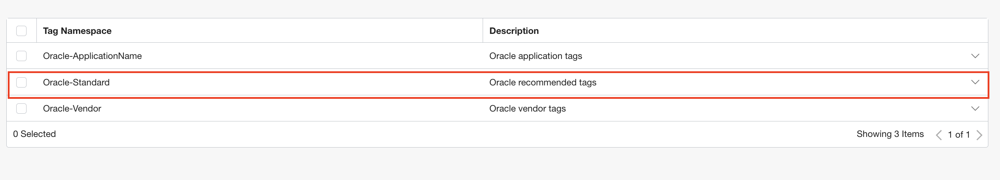

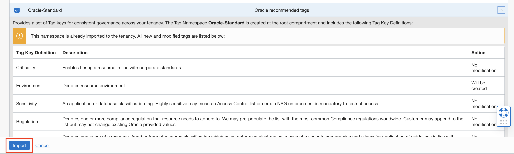

- On sucessful import, you should see **Oracle-Standard** Tag Namespace listed.

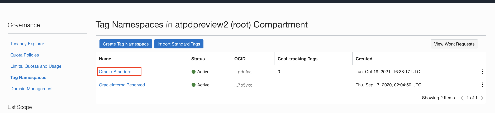

- In order to keep Tag Values consistent, a pre-defined Tag Values are provided. Currenlty the following Standard Tag Key Definitions are provided. 

**Oracle-Standard** Tag Namespace
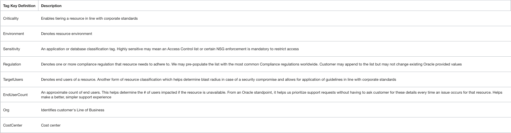

**Oracle-ApplicationName** Tag Namespace
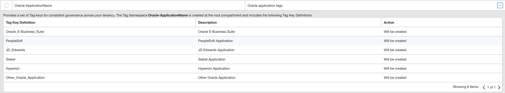

## Task 2: Create or Edit Tag Key Definition

Customers or Tag Admins can **Create** or **Edit** Tag Key Definitions based on their business needs.  Customer can add more **Values** to an existing Tag Key Definition or Create a new Tag Key Definition. 

- Click on **Governance & Administration** and navigate to **Tag Namespaces**. 

- Click on **Oracle-Standard** Tag Namespace.

- **Tag Namespace Details** page lists all the existing Tag Key Definitions. 

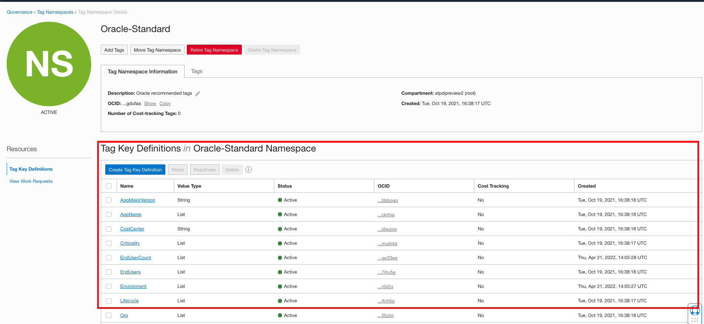

- Click on **Create Tag Key Definition** to create a new Tag Key definition in **Oracle-Standard** Namespace.

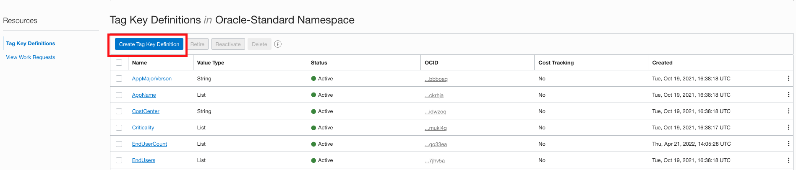

- Enter Tag Key, Description and Values and click **Create Tag Key Definition**.

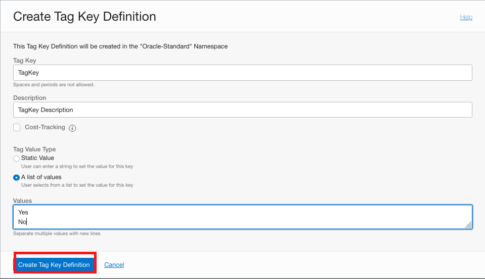

- Click on an existing Tag Key Definition, and **Edit Tag Key Definition** to add or remove values.

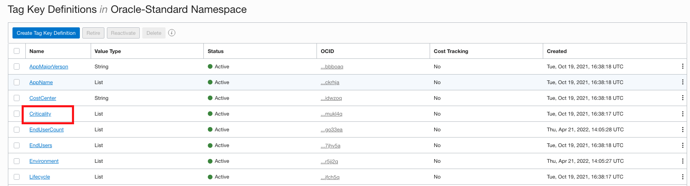

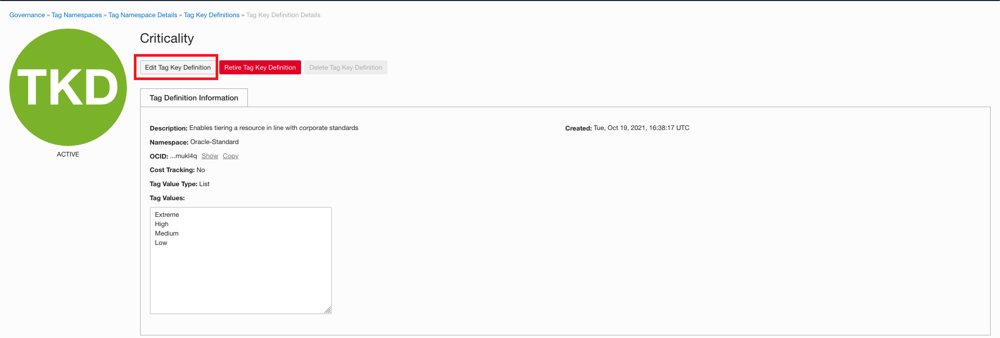

- Enter the New Tag Value and click on Save.

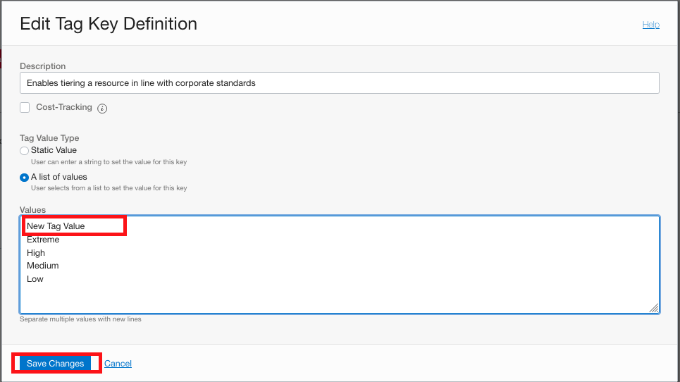

## Task 3: Use Oracle-Standard Tags with Autonomous database

Tags can be added to Autonomous Database either at the time of creation of resource or post creation. 

- Click on Menu and navigate to Autonomous Database. 

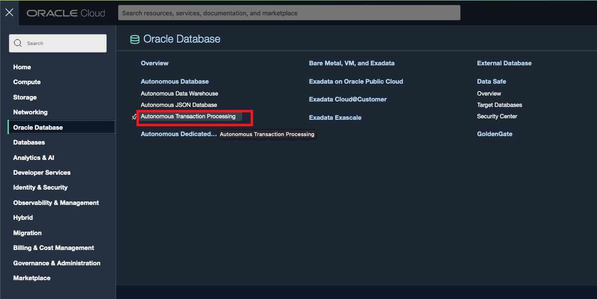

- Click on Create Autonomous Database, and enter all the required fields. You can learn how to create Autonomous Database in **Provisioning an Autonomous Transaction Processing Database Instance** under **Oracle Autonomous Database Dedicated for Developers and Database Users** Lab guided. 

- Scroll down to the bottom of Create Autonomous Database page, and click on **Show Advanced Options**. 

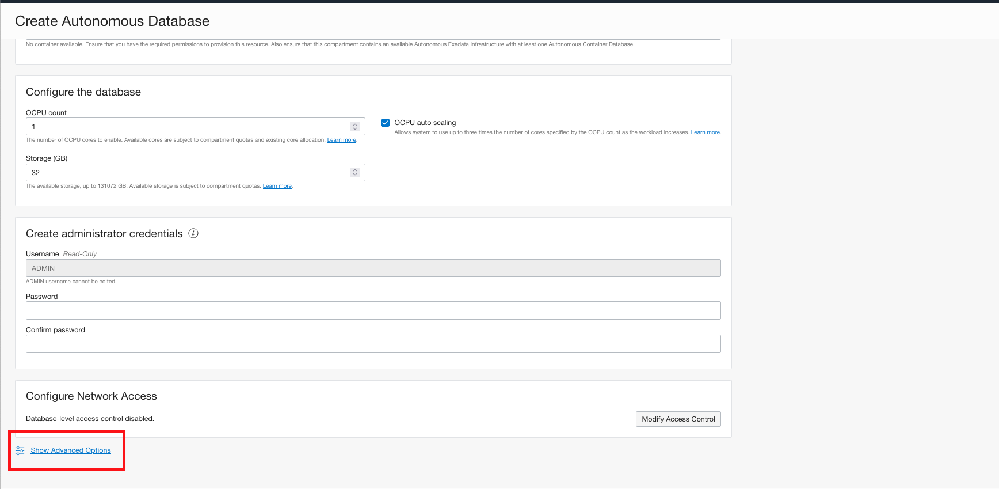

- Select Tags and select **Oracle-Standard** under **Tag Namespace** and select the appropriate Tag key. 

- Below screenshot show an example of Selecting Tag Key as **Criticality** of the ADB and **Tag Value** as **Extreme**.

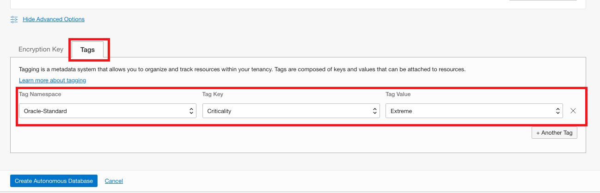

- You can also add Tags to an existing Autonomous database. Select the ADB that you would like to add the Tags and click on Tags. 

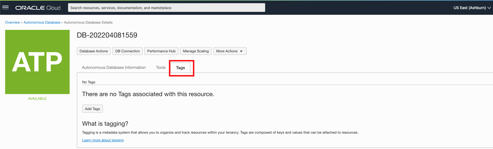

- Click on **Add tags** and select **Oracle-Standard** under Tag Namespace and select the appropriate **Tag Key** and **Tag Value**.

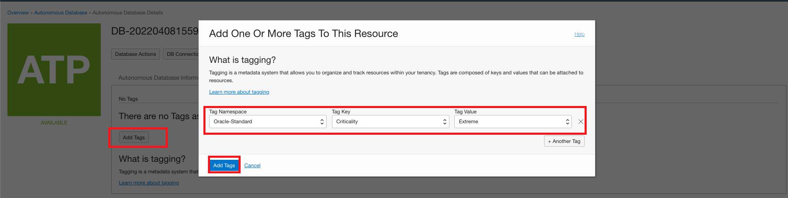

Click [this documentation](https://docs.oracle.com/en-us/iaas/Content/Tagging/Concepts/taggingoverview.htm) to learn more about Tagging.

## Acknowledgements

- **Author** - Tejus S. & Kris Bhanushali
- **Adapted by** -  Yaisah Granillo, Cloud Solution Engineer
- **Last Updated By/Date** - Kris Bhanushali, March 2022

## See an issue or have feedback?  
Please submit feedback [here](https://apexapps.oracle.com/pls/apex/f?p=133:1:::::P1_FEEDBACK:1).   Select 'Autonomous DB on Dedicated Exadata' as workshop name, include Lab name and issue / feedback details. Thank you!
